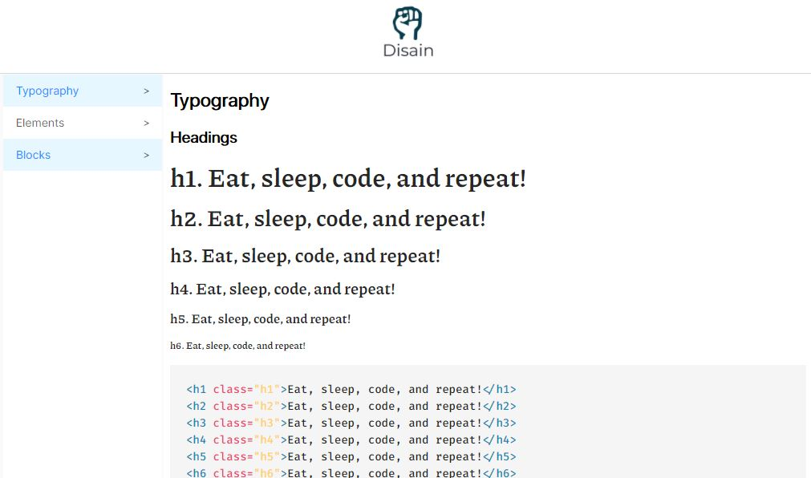

# Codeable - HTML & CSS Essentials

This is my first project of Codeable. Codeable is a peruvian bootcamp of full stack web development.

## Table of contents

- [Overview](#overview)
  - [The challenge](#the-challenge)
  - [Screenshot](#screenshot)
  - [Links](#links)
- [My process](#my-process)
  - [Built with](#built-with)
  - [What I learned](#what-i-learned)
  - [Continued development](#continued-development)
  - [Useful resources](#useful-resources)
- [Author](#author)
- [Acknowledgments](#acknowledgments)

**Note: Delete this note and update the table of contents based on what sections you keep.**

## Overview

### The challenge

- Make a separate HTML guide in 3 large parts: Typography, Elements and Blocks.

- The 3 parts will be on different pages and you can access each one from a sidebar.

- Also, each section should have a small sample of HTML code.

* It has no responsive design (for now)

### Screenshot



### Links

- Solution URL: [Solution link](https://github.com/heraldofortuna/html-css-essentials)
- Live Site URL: [Live site link](https://heraldofortuna.github.io/html-css-essentials/)

## My process

### Built with

- Semantic HTML5 markup
- CSS custom properties
- Flexbox
- CSS Grid

### What I learned

I learned how to write html label as text inside another html tag.

```html
<code class="code_line identation">
  <span class="code_line--tag">&lt;button</span>
  <span class="code_line--attribute">class=</span
  ><span class="code_line--value">&quot;button button--success&quot;</span
  ><span class="code_line--tag">&gt;</span>Apply now<span class="code_line--tag"
    >&lt;&sol;button&gt;</span
  >
</code>
```

## Author

- Codeable - [Codeable](https://www.codeable.la/)
- Twitter - [@heraldofortuna](https://twitter.com/heraldofortuna)
